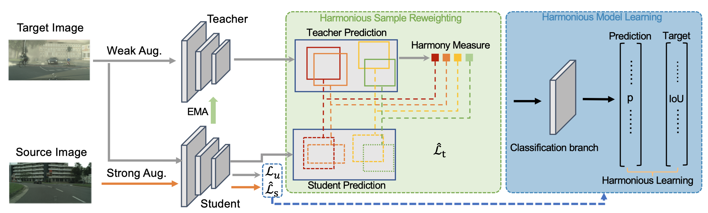

# Harmonious Teacher
This repository provides an implement for our CVPR2023 paper "[Harmonious Teacher for Cross-domain Object Detection](https://openaccess.thecvf.com/content/CVPR2023/papers/Deng_Harmonious_Teacher_for_Cross-Domain_Object_Detection_CVPR_2023_paper.pdf)" on Pytorch.



# Abstract
Self-training approaches recently achieved promising results in cross-domain object detection, where people iteratively generate pseudo labels for unlabeled target domain samples with a model, and select high-confidence samples to refine the model. In this work, we reveal that the consistency of classification and localization predictions are crucial to measure the quality of pseudo labels, and propose a new Harmonious Teacher approach to improve the self-training for cross-domain object detection. In particular, we first propose to enhance the quality of pseudo labels by regularizing the consistency of the classification and localization scores when training the detection model. The consistency losses are defined for both labeled source samples and the unlabeled target samples. Then, we further remold the traditional sample selection method by a sample reweighing strategy based on the consistency of classification and localization scores to improve the ranking of predictions. This allows us to fully exploit all instance predictions from the target domain without abandoning valuable hard examples. Without bells and whistles, our method shows superior performance in various cross-domain scenarios compared with the state-of-the-art baselines, which validates the effectiveness of our Harmonious Teacher. 

# Get Started
## Environments
```
# Prepare environments via conda
conda create -n dense-teacher python=3.8.5
conda install pytorch==1.10.1 torchvision==0.11.2 torchaudio==0.10.1 cudatoolkit=11.3 -c pytorch -c conda-forge

# install cvpods
python3 -m pip install -e cvpods

# recommend wandb for visualizing the training
pip install wandb

pip install imgaug
```
## Dataset
All the data arrangements follow the format of PASCAL_VOC. The dataset files are in the folder of `cvpods/cvpods/data/datasets` and the config path are in `cvpods/cvpods/data/datasets/paths_route.py`. Please refers to [cvpods](https://github.com/Megvii-BaseDetection/cvpods).

#### Cityscapes -> Foggy Cityscapes
* Please download Cityscapes and Foggy Cityscapes dataset from the [link](https://www.cityscapes-dataset.com/downloads/). Concretely, the `leftImg8bit_trainvaltest.zip` and `leftImg8bit_trainvaltest_foggy.zip` are used for Cityscapes and Foggy Cityscapes, respectively.
* We transform the original segmentation annotations to detection formats using `tools/get_anno_multi.py`, which comes from this [project](https://github.com/ChrisAllenMing/GPA-detection).

#### Cityscapes -> BDD100K
* For Cityscapes, we use above method to prepare dataset. Because the adaptation from Cityscapes to BDD100K are evaluated on 7 classes, we change the `CLASS_NAMES` in `cvpods/cvpods/data/datasets/city_7cls.py`.
* For BDD100K, we download the dataset from [link](https://bdd-data.berkeley.edu/). We select the needed categories and remove the unused images.

#### KITTI -> Cityscapes
* Download KITTI dataset from the following links: [KITTI](http://www.cvlibs.net/datasets/kitti/eval_object.php?obj_benchmark=2d).
* For Cityscapes, we use above method to prepare dataset. Because the adaptation from Cityscapes to Cityscapes are evaluated only on `car`, we change the `CLASS_NAMES` in `cvpods/cvpods/data/datasets/city_car.py`.

#### Sim10K -> Cityscapes
* Download Sim10k dataset: [Sim10k](https://fcav.engin.umich.edu/projects/driving-in-the-matrix). Particularly, we use `repro_10k_images.tgz` and `repro_10k_annotations.tgz` for Sim10k.
* For Cityscapes, we use above method to prepare dataset. Because the adaptation from Cityscapes to Cityscapes are evaluated only on `car`, we change the `CLASS_NAMES` in `cvpods/cvpods/data/datasets/city_car.py`.

We plan to release all the prepared data for convient reproduction. Please stay tuned.

## Pretrained Model
We use the VGG16 as the backbone, the pretrained model can be downloaded from this [link](https://drive.google.com/file/d/1Nb2sYh8GHiEUDtfUn5Buwugu6bNd1VbT/view?usp=sharing). Then the `MODEL.WEIGHTS` should be updated in `config.py` correspondingly.

## Training
```
cd ht_c2f/
CUDA_VISIBLE_DEVICES=0,1,2,3 pods_train --dir . --dist-url "tcp://127.0.0.1:29007" --num-gpus 4 OUTPUT_DIR 'outputs/ht_c2f'
```
* If you want use `wandb`, specify wandb account in `runner.py` and then add `WANDB True` into the command.
* The model is trained on 4 RTX 3090 GPUs.

## Testing
```
CUDA_VISIBLE_DEVICES=0,1,2,3 pods_test --dir . --num-gpus 4 MODEL.WEIGHTS $model_path
```
Note that if you provide a relative model path, the `$model_path` is the relative path to `cvpods`. It is recommended to use the absolute path for loading the right model.

## Acknowledgement
This repo is developed based on DenseTeacher and cvpods. Please check [DenseTeacher](https://github.com/Megvii-BaseDetection/DenseTeacher) and [cvpods](https://github.com/Megvii-BaseDetection/cvpods) for more details and features.

## Citation
If you think this work is helpful for your project, please give it a star and citation. We sincerely appreciate for your acknowledgments.
```
@inproceedings{deng2023harmonious,
  title={Harmonious Teacher for Cross-Domain Object Detection},
  author={Deng, Jinhong and Xu, Dongli and Li, Wen and Duan, Lixin},
  booktitle={Proceedings of the IEEE/CVF Conference on Computer Vision and Pattern Recognition},
  pages={23829--23838},
  year={2023}
}
```
## Issues
If you have encountered some issues, please first refer to [issue]().

## License
This repo is released under the Apache 2.0 license. Please see the LICENSE file for more information.
